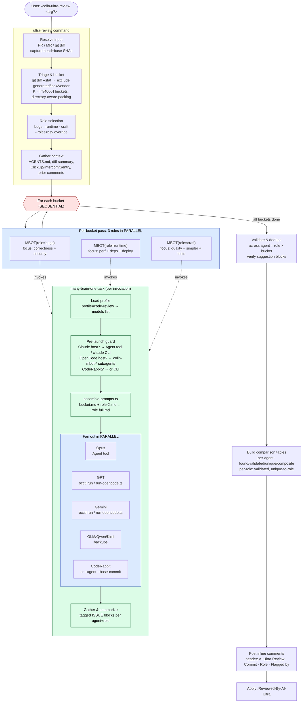

# Colin's dotfiles

Personal dotfiles plus a batteries-included Claude Code config for shipping software with AI agents — slash commands for review, planning, and merging; skills for platform CLIs and common frameworks; and a multi-model review and audit toolkit (MBOT) that runs the same diff past Opus, GPT, Gemini, and friends in parallel.

## Highlights

- **Code review workflows.** `/colin-review` runs a focused single-agent review, while `/colin-ultra-review` fans out across MBOT models and roles, dedupes findings, and posts inline comments on GitHub PRs or GitLab MRs.
- **Spec critique and group decisions.** `/colin-critique` and the MBOD debate skill stress-test plans before you write code.
- **Production-readiness audit.** `/colin-ultra-audit` runs three roles (hardening, operability, stewardship) against the current repo state, grouped by severity.
- **Boring shell quality of life.** Sensible Bash, Git, tmux, Vim, Delta, and [Starship](https://starship.rs/) configs with non-clobbering installs for `.bashrc` and `.gitconfig`.
- **Yours to configure.** Models, harnesses, and providers come from plain-prose Markdown profiles you own.

## Contents

- [Quickstart](#quickstart)
- [What gets installed](#what-gets-installed)
- [Shell helpers](#shell-helpers)
- [VS Code dev containers](#vs-code-dev-containers)
- [AI tools reference](#ai-tools-reference)
  - [Agents](#agents)
  - [Slash commands](#slash-commands)
  - [Skills](#skills)
  - [Using MBOD](#using-mbod-many-brain-one-decision)
  - [Customizing MBOT](#customizing-mbot-your-models-your-harness)
  - [Typical flows](#typical-flows)
- [License](#license)

## Quickstart

Clone the repo and run `install.sh`. The script never overwrites `.bashrc` or `.gitconfig` — it appends an `include` directive so the `.colin` variants load alongside whatever you already have.

```bash
git clone https://github.com/colinmollenhour/dotfiles.git ~/.dotfiles
cd ~/.dotfiles

# Interactive — choose what to install
./install.sh

# Install everything
./install.sh --all

# Install only the AI agent configs
./install.sh --agents

# Install only the dotfiles
./install.sh --dotfiles

# Show every flag
./install.sh --help
```

**First-time install on an existing system** — if destination files already exist, an interactive run lets you keep, overwrite, back up, or diff each conflict. You can also keep or overwrite all remaining conflicts. Non-interactive runs skip conflicting files; pass `--force` to overwrite them all:

```bash
./install.sh --all --force
```

Subsequent runs are safe without `--force`: the script tracks which files it installed and their hashes, so it only updates files it owns that haven't been manually changed. Copied files retain the repository source's modification time, making a destination with a newer mtime an easy visual indicator that it was subsequently saved by a user; hashes remain the authoritative conflict check.

After installation, run `colin-help` for the cheat sheet of aliases, shortcuts, and tools. The same content lives at the [top of `.bashrc.colin`](https://github.com/colinmollenhour/dotfiles/blob/main/.bashrc.colin#L2).

## What gets installed

### Dotfiles

| File | Behavior |
|---|---|
| `.bashrc.colin` | Sourced from `.bashrc` (non-clobbering append) |
| `.gitconfig.colin`, `.gitignore.global`, `.gitattributes.global` | Included from `.gitconfig` (non-clobbering append) |
| `.tmux.conf`, `.vimrc`, `.config/starship.toml`, etc. | Installed and tracked — updated on future runs unless you've edited them locally |

The installer tracks every file it owns in `~/.local/share/colin-dotfiles/manifest`. On each run it:

- **Prompts** on conflicts in a TTY, with options to keep, overwrite, back up, or view a unified diff.
- **Skips** conflicting files in non-interactive runs and warns you (use `--force` to overwrite anyway).
- **Deletes** installed files whose source was removed from the repo, but only if you haven't modified them locally.

### Claude Code config

Slash commands, skills, agents, a status line, and worktree helpers install into `~/.claude/`. The `--agents` flag also mirrors them into `~/.opencode/`, `~/.agents/`, and `~/.gemini/antigravity/` when those tools are present, so the same commands work across harnesses.

## Shell helpers

- `colin-help` — list every alias, command, and tip.
- `note [text]` — display a styled terminal sticky note, prompting for its contents when text is omitted.
- `install-recommended`, `install-packages`, `update-packages` — package installers backed by `brew`, `npm`, `apt`, and raw `curl | bash`.
- Fuzzy finders for files, Git branches, Docker containers, processes to stop, SSH hosts, exported variables, and unset variables.

## VS Code dev containers

Drop this into your `settings.json` to auto-install on every dev container:

```json
{
  "dotfiles.repository": "colinmollenhour/dotfiles",
  "dotfiles.targetPath": "~/.dotfiles",
  "dotfiles.installCommand": "~/.dotfiles/install.sh --all"
}
```

---

# AI tools reference

A reference to the shared slash commands, skills, and agents in `.claude/`. Invoke slash commands directly (`/colin-review` for Claude Code, `/colin/review` for OpenCode). Skills load automatically when relevant or you can name them in a prompt.

## Concepts

- **Slash commands** (`/name`) kick off workflows. You type them.
- **Skills** are reusable procedures Claude loads on demand, often invoked internally by commands.
- **MBOT agents** are dedicated subagents backed by specific models. The review, critique, audit, and MBOD commands use them to gather multi-model opinions. Which models run, and through which harness, is driven by MBOT-style profile files — see [Customizing MBOT](#customizing-mbot-your-models-your-harness).

## Agents

### `megamind`

`megamind` is the autonomous large-task delivery agent. Give it an objective, spec, issue, task URL, or plan file, and it drives the work from intake to delivery with only one optional human checkpoint: review after a non-unanimous MBOD decision.

At a high level, it:

- Resolves the task source, records repo context, and creates a durable `.tmp/megamind-<slug>/` run directory for plans, critiques, decisions, agent reports, reviews, CI logs, and final delivery notes.
- Uses MBOT to critique the starting plan, then produces a refined implementation plan. If the plan has unresolved choices, it bundles them into one MBOD decision round, asks for human review only when the MBOD result is not unanimous, and folds the result into `plans/final.md`.
- Splits implementation into one to three disjoint work packages, launches coding agents, inspects their reports and diffs, and runs integration checks.
- Runs an ultra-review pass across correctness/security, runtime/deployment risk, and craft/test quality; validates findings; assigns fix work; and confirms the fixes with a focused review pass.
- Runs final local gates, creates a feature branch, commits only task-related files, pushes, and opens or updates a GitHub PR or GitLab MR with artifact links and test results.
- Launches an educational synthesis sub-agent after the PR/MR exists, validates its claims against Megamind artifacts and diffs, then appends a dense journey/design/architecture/lessons brief to the PR/MR.
- Monitors CI after the PR/MR exists, fixes minor CI failures autonomously, and stops only when CI is green or a blocker file documents the exact evidence and next action.
- With `--evidence`, packages the completed run artifacts into a ZIP and attaches it to the PR/MR. Evidence packaging is skipped by default.

Use `megamind` for long-running work where the desired output is not just code, but a completed branch, review item, local gate results, and CI status. Use `--dry-run` to have it write the execution outline without launching agents or changing code, include `skip human review` to have it make the best call autonomously after a split MBOD result, or pass `--evidence` to attach the final artifact archive.

```mermaid
flowchart TD
    Request["User request: objective, spec, issue, or plan"] --> Intake["Resolve source and create .tmp/megamind run directory"]
    Intake --> Context["Capture repo context, dirty state, base branch, and local gates"]
    Context --> Critique["MBOT critique: contradictions, gaps, naming, and design risks"]
    Critique --> Plan["Planner writes second draft and readiness status"]
    Plan --> Decision{"Unresolved decisions?"}
    Decision -->|"Yes"| MBOD["MBOD debate chooses direction"]
    MBOD --> ReviewGate{"MBOD unanimous?"}
    ReviewGate -->|"No, unless skipped"| Human["Ask one human review question"]
    ReviewGate -->|"Yes"| FinalPlan["Write final implementation plan"]
    Human --> FinalPlan
    Decision -->|"No"| FinalPlan
    FinalPlan --> Split["Split into one to three disjoint work packages"]
    Split --> Agents["Delegated coding agents implement assigned scopes"]
    Agents --> Integrate["Inspect diffs, reports, and cheap integration checks"]
    Integrate --> UltraReview["Ultra review: bugs, runtime, and craft"]
    UltraReview --> Fixes{"Validated findings?"}
    Fixes -->|"Yes"| Fix["Route targeted fix agents and verify fixes"]
    Fix --> UltraReview
    Fixes -->|"No"| Gates["Run final local gates"]
    Gates --> Delivery["Commit, push branch, and open or update PR/MR"]
    Delivery --> Education["Generate and validate educational brief"]
    Education --> CI["Monitor CI and fix minor failures"]
    CI --> Evidence{"Evidence requested?"}
    Evidence -->|"Yes"| Archive["Package and attach evidence ZIP"]
    Evidence -->|"No"| Done{"Green CI or documented blocker"}
    Archive --> Done
```



### Pi package

This repo also includes `pi-megamind/`, a draft Pi package that bundles Megamind as a Pi skill plus a `/megamind` prompt template. Try it without installing permanently:

```bash
pi -e ./pi-megamind
```

Or install it from this checkout:

```bash
pi install ./pi-megamind
```

The package defaults MBOT/MBOD delegation to Pi-backed participants and prefers the lightweight `pi-fast-subagent` extension when available.

## Slash commands

### `colin-*` — day-to-day dev workflow (name-spaced to avoid conflicts)

#### Shipping

| Command | Use it when… |
|---|---|
| `/colin-commit-and-push` | You're done with changes. Commits, pushes, opens or updates a GitHub PR or GitLab MR. |
| `/colin-fix-comments` | Address open review comments on the current branch's PR or MR. Posts fixes, rebuttals, and a summary. |
| `/colin-fix-pipeline` | Diagnose and fix a failing GitHub Actions or GitLab CI pipeline on the current branch. |
| `/colin-fix-conflicts` | Resolve Git merge conflicts intelligently, preserving intent from both sides. |
| `/colin-squash-merge [branch]` | Squash-merge a branch onto trunk with one clean commit **per author**, each AI-summarized. |
| `/colin-git-cleanup` | Delete local branches that have been merged remotely (including squash-merges). |

#### Reviewing

Both review commands resolve the target the same way. Pass no argument to review the open PR or MR for your current branch. Otherwise the target accepts: a PR or MR URL or number, `last N commits`, `whole repo`, `branch NAME`, or a Git rev spec like `SHA..SHA`.

**`/colin-review [target] [flags]`** — standard single-agent review. Triages, buckets large diffs (≤ 5,000 lines runs as a single pass; otherwise ~3,000-line buckets grouped by top-level directory), reviews each bucket directly, validates and deduplicates issues, posts inline comments, and applies the `:Reviewed-By-AI` label. It does not use MBOT or `colin-mbot-*` agents; use `/colin-ultra-review` for multi-model fan-out.

| Flag | Effect |
|---|---|
| `--re-review` | Only review commits since the last `**AI Code Review**` comment on the PR or MR. |
| `--no-post` | Print comments to the terminal and wait for `post`, `drop issue 3`, `edit issue 2 to …`, or `cancel` instead of auto-posting. |
| `--no-summary` | Skip the review summary comment. |

In Git-diff mode (when the target is a rev spec rather than a PR or MR) the command always behaves as `--no-post` — nothing is posted, just displayed.

**`/colin-ultra-review [target] [agents] [flags]`** — the heavyweight variant. Runs **3 roles × N models** per bucket in parallel: `bugs` (correctness and security), `runtime` (performance, dependencies, deploy safety), and `craft` (quality, simplification, test quality). Expensive — reserve for important merges. Uses a separate `:Reviewed-By-AI-Ultra` label and a separate `**AI Ultra Review**` comment history, so it can run alongside `/colin-review` on the same PR.

| Flag | Effect |
|---|---|
| `[agents]` (positional) | Model list for this run. Overrides the MBOT profile. |
| `--roles=bugs,runtime,craft` | Restrict to specific roles. Default is all three. |
| `--re-review` | Only review commits since the last `**AI Ultra Review**` comment. |
| `--no-post` | Same as `/colin-review`. |
| `--no-summary` | Skip both the per-model and per-role comparison tables. |

##### How ultra-review fans out across MBOT

Buckets run **sequentially** to bound cost. Within each bucket, the three roles invoke MBOT **in parallel**, and each MBOT call fans out to **N models in parallel** — so a single bucket pass produces `3 × N` reviewer threads with the same diff but different role focus prompts.



**`/colin-critique [target] [flags]`** — adversarial multi-model critique of a spec or plan document, not code. Flags contradictions, gaps, poor naming, and inferior design choices. **Never** suggests scope expansion or "nice-to-haves". The target is a file path, `current plan` (the in-session plan), or a ClickUp TaskID. With no target, it searches for `SPECS-*.md` then `PLAN*.md`.

| Flag | Effect |
|---|---|
| `--agents opus gpt …` | Override the MBOT `critique` profile for this run. |
| `--summary` | Include a per-model comparison table (found, validated, unique, accuracy, composite score). |

**`/colin-ultra-audit [scope] [agents] [flags]`** — production-readiness audit of the **current repo state**, not a diff. Runs **3 roles × N models** per module bucket: `hardening` (security and resiliency), `operability` (observability, deployment, config, performance, dependencies), and `stewardship` (docs, tests, code quality). Findings merge and group by severity (`Blocker`, `High`, `Medium`, `Low`). Display only — no PR comments, no labels. Expensive — reserve for pre-launch or quarterly checkups.

| Flag | Effect |
|---|---|
| `[scope]` (positional) | `whole repo` (default), a path, comma-separated paths, or a glob. |
| `[agents]` (positional) | Model list for this run. Overrides the MBOT profile. |
| `--roles=hardening,operability,stewardship` | Restrict to specific roles. Default is all three. |
| `--save <PATH>` | Also write the rendered report to `<PATH>`. |
| `--no-summary` | Skip both the per-model and per-role comparison tables. |

#### Planning and porting

| Command | Use it when… |
|---|---|
| `/colin-finalize-spec` | Augment the current plan with the senior-SWE planning sections needed before implementation. |
| `/colin-feature-export <FEATURE>` | Generate a portable implementation guide for moving a feature to a sibling repo. |
| `/colin-handoff [PATH]` | Dump the current session context into a portable Markdown handoff doc. No tool calls, just context. |
| `/colin-progress` | Audit the in-scope task and keep working until it's actually 100% done. Forbids deferring parts of the spec. |

## Skills

Claude loads these automatically when a task matches, or you can reference them by name.

### Platform CLIs

- **`gh-cli`** — GitHub operations through `gh` (PRs, issues, runs, inline comments, raw API).
- **`glab-cli`** — GitLab operations through `glab` (MRs, pipelines, discussions, raw API).
- **`clickup-tasks`** — Create and update ClickUp tasks, custom fields, sprint work. Supports both CLI and MCP backends.
- **`github-security-advisories`** — End-to-end GitHub Security Advisory (GHSA) handling: validate a report, prepare advisory fields, push fixes to the GHSA private fork.

### Code generation and review

- **`many-brain-one-task`** (MBOT) — Run the same prompt across many models and compare or merge results. Powers `/colin-critique`, `/colin-ultra-review`, and `/colin-ultra-audit`. Configurable — see [Customizing MBOT](#customizing-mbot-your-models-your-harness).
- **`many-brain-one-decision`** (MBOD) — Coordinate a multi-round debate across MBOT agents with distinct personalities until they converge on a decision or hit the configured round limit. Use it for prompts like "decide which option is best", "debate this tradeoff", or "propose a solution to this problem".
- **`educational-brief`** — Creates grounded journey/design/architecture/lessons briefs for delivered PRs, MRs, branches, features, or agent runs.
- **`generate-e2e-test`** — Drives Playwright MCP through a workflow, then generates the E2E test code.
- **`security-hardening`** — App-level security review covering abuse prevention, rate limiting, business logic, and input validation. Beyond generic checklists.
- **`cli-design`** — Design and review CLIs against `clig.dev` guidelines: flags, help text, errors, and scriptability.
- **`docs-writer`** — Write or restructure technical docs against Diataxis, Google, Microsoft, and Write the Docs style guides.
- **`skill-writer`** — Author new `.claude` skills with correct frontmatter and structure.

### Frameworks and stacks

- **`coolify`** — Generate a `docker-compose.coolify.yml` for the current project using Coolify conventions and `SERVICE_*` secrets.
- **`drizzle-orm`** — TypeScript-first ORM patterns for Postgres, MySQL, and SQLite: schemas, queries, migrations, relations.
- **`nuxt-ui`** — Nuxt UI components. Fetches current docs from `ui.nuxt.com/llms.txt` so APIs are accurate.
- **`nuxt-content`** — Author Markdown and MDC content files for Nuxt Content sites.
- **`voltagent`** — Build VoltAgent AI agents: tools, memory, hooks, sub-agents.

### Media

- **`nano-banana`** — Required for any image generation or editing. Wraps the Gemini CLI.

## Using MBOD (Many Brain One Decision)

`many-brain-one-decision` reuses the same MBOT agent pool, but the host thread acts as a moderator instead of sending every model the exact same task. It gathers the current chat context into a decision brief, assigns each selected model a distinct debating personality, runs debate rounds in parallel, summarizes the results, eliminates weak options when appropriate, and returns a final decision with dissent and risks.

Example prompts:

```text
Use many-brain-one-decision to decide which pizza toppings are best in 3 rounds or less.
Use MBOD to debate whether we should use Postgres triggers, app-layer events, or a queue.
Use many-brain-one-decision to propose a solution to this scaling problem: [facts...]
```

### Decision modes

- **Fixed choice** — when the user gives explicit options or asks for multiple choice. MBOD preserves the supplied options and has each debater choose, score, and argue.
- **Open proposal** — when the user provides facts and asks to propose, design, or solve. Round 1 lets each debater organically propose a solution; the moderator clusters those proposals into candidate outcomes for later rounds.
- **Hybrid** — when the user gives initial options but allows alternatives. MBOD includes the supplied options plus `WRITE_IN`.

### Round behavior

- Default max rounds: 4.
- The user can override naturally: "in 3 rounds or less", "one round only", or `--rounds 2`.
- Consensus means all active debaters choose the same outcome.
- Without consensus by the final round, MBOD recommends a winner by vote count, average score, least-regret score, then host judgment against the stated criteria.

### Routing and profiles

Harness routing follows MBOT's rules with one cost-sensitive exception: Claude-backed debaters use native Claude agents or the `claude` CLI first so usage stays on the Claude Max plan. Use `colin-mbot-opus` or `colin-mbot-sonnet` only when the CLI does not work or the user explicitly requests OpenCode-routed Claude. Claude-hosted runs still use the sibling MBOT `run-opencode.ts` helper for OpenCode-backed debaters.

Profiles live in `~/.claude/skills/many-brain-one-decision/` and use the same plain-prose style as MBOT profiles. If an MBOD profile is missing, the skill falls back to the sibling MBOT profile for agent selection. Profile lines may also pin personalities:

```markdown
Use the following:
- OpenCode with GPT-5.5 with "high" variant as "tech-bro"
- OpenCode with Gemini 3.1 Pro as "bean-counter"
- Claude Opus with "max" thinking as "pragmatic-operator"
For OpenCode use `--attach seamus:4095`
```

## Customizing MBOT (your models, your harness)

**Set up your own MBOT profiles.** The defaults shipped in this repo are one person's preferences — your API keys, entitlements, and trust in specific models will differ. Every review, critique, and audit run consults these profile files to decide which models to launch and through which harness.

### How profile resolution works

When MBOT starts, it picks a profile in this order:

1. An explicit `--profile X` in the prompt loads `X.md`.
2. The task type (`code-review` or `critique`) loads `code-review.md` or `critique.md`.
3. Anything else falls back to `default.md`.
4. If the chosen file does not exist, MBOT tries `default.md`. If that is also missing, it uses hardcoded defaults (Opus through the `claude` CLI, Grok through the `grok` CLI when available, plus GPT, Gemini, GLM, Qwen, MiMo, and Kimi through OpenCode; OpenCode `colin-mbot-grok` is the Grok fallback).

All profile files live in `~/.claude/skills/many-brain-one-task/`, beside the `SKILL.md` file. Profiles are a plain Markdown bullet list — model and harness, one per line.

### Example: `default.md`

```markdown
Use the following:
- claude CLI with "opus" and "max" thinking
- OpenCode with GPT-5.4 with "xhigh" variant via OpenCode Zen
- OpenCode with GLM 5.1
- OpenCode with Qwen 3.6 Plus
```

### Example: `code-review.md`

```markdown
Use the following:
- claude CLI with "opus" and "max" thinking
- OpenCode with GPT-5.4 with "xhigh" variant via OpenCode Zen
- OpenCode with GLM 5.1 via Z.ai Coding Plan
- OpenCode with Gemini 3.1 Pro via OpenCode Zen
```

### Writing your own profile

Copy one of the examples above and edit to taste. You can specify:

- **Which models** (e.g. Opus 4.6, GPT 5.4 Codex, Gemini 3.1 Pro, Grok 4.20, Kimi K2.6, MiniMax M2.5).
- **Which harness** drives each model (`claude` CLI, `grok` CLI, `codex`, `gemini`, `opencode`). Constraints:
  - Claude Code can only run Claude models natively. Non-Claude models go through another harness (prefer `grok` CLI for Grok; otherwise typically OpenCode).
  - OpenCode **must** call `claude` for Claude models, and should prefer the first-party `grok` CLI for Grok when installed; other non-Claude models run as OpenCode subagents.
  - Grok CLI can run Grok models natively (or via headless `grok --prompt-file`); shell out for everything else.
  - Codex drives only OpenAI models natively. Same story for the Gemini CLI.
- **Which provider or route** (e.g. `via OpenCode Zen`, `via Z.ai Coding Plan`, `via OpenRouter`). Prefer coding-plan routes over generic `openrouter/` or `opencode/` when you have entitlements — they are cheaper or uncapped.
- **Model-specific knobs** (e.g. `"max" thinking`, `"xhigh" variant`).
- **Backups** — list fallbacks so a failed primary swaps automatically.
- **OpenCode server attach** — point MBOT at a running `opencode serve` instance instead of spawning a fresh local OpenCode per agent. Add a global line like `Attach OpenCode to seamus:4096 with password hunter2` (applies to every OpenCode agent in the run) or `via attach seamus:4096` on a single agent line (overrides for that agent only). MBOT translates this into `opencode run --attach http://… --password … --dir . …`.

  **Path-prefix requirement:** the remote server must see the project at the *same absolute path* as the host. The container's home directory has to match the host's home directory prefix (host `/home/colin/proj/foo` → remote also resolves `/home/colin/proj/foo`). When the remote runs in a container, bind-mount or symlink so `$HOME` matches. Without this, `--file .tmp/...` and `--dir .` resolve to the wrong place on the remote and the run fails. Falls back to local OpenCode when the remote is not reachable.

Profiles are prose. MBOT reads them naturally and translates them into the right CLI or subagent invocations. No JSON schema, no YAML, no tooling required.

### Overriding per run

- `[agents]` on `/colin-ultra-review` (positional, e.g. `gpt gemini kimi`) overrides the profile for that run only.
- `--agents opus gpt gemini` on `/colin-critique` does the same.
- `--profile X` in a prompt forces profile `X.md`.
- `--dry-run` in a prompt makes MBOT report its execution plan instead of launching anything. Useful for verifying a new profile.

### MBOT subagent registry

The `.claude/agents/colin-mbot-*.md` files register each model as a callable subagent (read-only — `write: false`). They are how OpenCode-hosted MBOT runs dispatch to a specific model. You normally do not invoke them directly, but you reference them by short name in profiles and `[agents]` overrides.

Sorted roughly by capability:

| Agent | Model |
|---|---|
| `colin-mbot-opus` | Anthropic Claude Opus 4.8 |
| `colin-mbot-gpt` | OpenAI GPT 5.6 Sol |
| `colin-mbot-gpt-zen` | GPT 5.6 Sol through OpenCode Zen |
| `colin-mbot-gpt-terra` | OpenAI GPT 5.6 Terra |
| `colin-mbot-gpt-terra-zen` | GPT 5.6 Terra through OpenCode Zen |
| `colin-mbot-grok` | xAI Grok 4.5 (OpenCode fallback; prefer `grok` CLI when available) |
| `colin-mbot-sonnet` | Anthropic Claude Sonnet 5 |
| `colin-mbot-glm` | Zhipu GLM 5.2 |
| `colin-mbot-gemini-pro` | Gemini 3.1 Pro (OpenRouter) |
| `colin-mbot-gemini-pro-zen` | Gemini 3.1 Pro through OpenCode Zen |
| `colin-mbot-qwen` | Alibaba Qwen 3.7 Max |
| `colin-mbot-kimi` | Moonshot Kimi K2.7 Code |
| `colin-mbot-mimo` | Xiaomi MiMo V2 Pro |
| `colin-mbot-deepseek` | DeepSeek v4 Pro |
| `colin-mbot-minimax` | MiniMax M3 |

Add your own by dropping a new `colin-mbot-<NAME>.md` into `.claude/agents/` with `mode: subagent`, the desired `model:`, and `tools: { write: false }`.

## Typical flows

- **Shipping a change.** Make edits → `/colin-review` → `/colin-commit-and-push` → on feedback `/colin-fix-comments` → on red CI `/colin-fix-pipeline`.
- **Planning a feature.** `/agent-sops-pdd` → `/colin-finalize-spec` → `/colin-critique --summary` → `/agent-sops-code-task-generator`.
- **Important merge.** `/colin-ultra-review --no-post` → review the output → `post` if it looks right. Use `--re-review` on subsequent pushes.
- **Picking up someone else's context.** Ask them to run `/colin-handoff` and commit the resulting Markdown.

## License

MIT — see [LICENSE](LICENSE).
