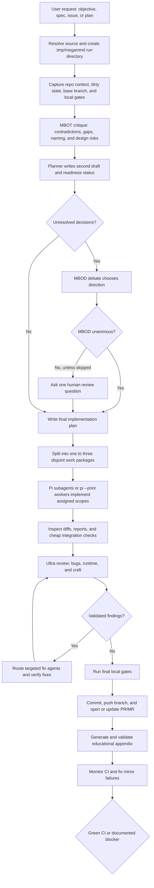

# pi-megamind

Pi package for the Megamind autonomous delivery workflow and supporting multi-agent skills copied from this dotfiles repo.

## Contents

- `skills/megamind/` — Megamind autonomous delivery workflow.
- `skills/many-brain-one-task/` — MBOT multi-model fan-out skill plus helper scripts.
- `skills/many-brain-one-decision/` — MBOD moderated multi-agent decision workflow.
- `skills/educational-brief/` — grounded educational appendix synthesis.
- `skills/gh-cli/`, `skills/glab-cli/` — hosted PR/MR and CI platform operations.
- `skills/claude-cli/`, `skills/codex-cli/` — CLI routing references used by MBOT/MBOD.
- `prompts/megamind.md` — Pi slash prompt for `/megamind`.

## Local install

From this repo root:

```bash
pi install ./pi-megamind
```

Or try it for one Pi session without adding it to settings:

```bash
pi -e ./pi-megamind
```

Then invoke:

```text
/megamind <objective, plan file, issue URL, or task ID>
```

This package defaults MBOT/MBOD delegation to Pi-backed participants. If the lightweight `pi-fast-subagent` extension is installed, Megamind should prefer in-process Pi child agents through that package; otherwise it falls back to shelling out with `pi --print < prompt.md`.

Optional recommended install:

```bash
pi install npm:pi-fast-subagent
```

Useful flags supported by the Megamind workflow include:

- `--dry-run` — write the execution outline only.
- `--max-coders 1|2|3` — cap implementation agents.
- `--base <branch>` — set base branch.
- `--agents <list>` — pass through model/agent selection.
- `--skip-human-review` or `skip human review` — do not pause after split MBOD decisions.

## How it works



## Notes

This package intentionally preserves the source workflow text closely. The MBOT/MBOD skills still mention Claude Code, OpenCode, `occtl`, `claude`, and `codex` routing because Megamind can still use those external CLIs/harnesses when explicitly requested. The packaged default route is Pi.

Pi packages run with full system access through skills and any invoked helper scripts. Review the copied skill content before installing globally or publishing.
