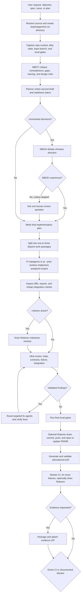

# Megamind for OMP and Pi

Installable Megamind autonomous-delivery workflow with supporting multi-agent skills. The same package works in OMP and Pi.

## Contents

- `skills/megamind/` — Megamind autonomous delivery workflow.
- `skills/many-brain-one-task/` — MBOT multi-model fan-out skill plus helper scripts.
- `skills/many-brain-one-decision/` — MBOD moderated multi-agent decision workflow.
- `skills/educational-brief/` — grounded educational brief synthesis.
- `skills/gh-cli/`, `skills/glab-cli/` — hosted PR/MR and CI platform operations.
- `skills/claude-cli/`, `skills/codex-cli/`, `skills/grok-cli/` — CLI routing references used by MBOT/MBOD.
- `prompts/megamind.md` — shared `/megamind` prompt template.

## OMP

Install from this checkout:

```bash
omp install ./pi-megamind
```

Start OMP in the target repository and invoke Megamind:

```text
/megamind <objective, plan file, issue URL, or task ID> [flags]
```

The command changes the current, user-visible OMP session into Megamind mode. That session remains the `Main` orchestrator; it uses OMP's native `task` tool only for bounded child work. Megamind itself is not hidden behind a subagent.

Try the package for one session without installing it:

```bash
omp --extension ./pi-megamind
```

For a non-interactive smoke run:

```bash
omp --extension ./pi-megamind -p \
  '/megamind Check this integration --dry-run --agents omp'
```

## Pi

Install from this checkout:

```bash
pi install ./pi-megamind
```

Or try it for one Pi session without adding it to settings:

```bash
pi -e ./pi-megamind
```

Then invoke the same `/megamind` command. The Pi route defaults MBOT/MBOD delegation to Pi-backed participants. If the lightweight `pi-fast-subagent` extension is installed, Megamind should prefer in-process Pi child agents through that package; otherwise it falls back to `pi --print < prompt.md`.

Optional recommended Pi install:

```bash
pi install npm:pi-fast-subagent
```

Useful flags supported by the Megamind workflow include:

- `--dry-run` — write the execution outline only.
- `--roborev` — opt into Roborev detection and review drains for an already enrolled repo; without it Megamind runs no Roborev probes or commands.
- `--max-coders 1|2|3` — cap implementation agents.
- `--base <branch>` — set base branch.
- `--agents <list>` — pass through model/agent selection; use `omp` for OMP-native children or `pi` for Pi-backed children.
- `--evidence` — create a ZIP of the completed run artifacts and attach it to the PR/MR; skipped by default.
- `--skip-human-review` or `skip human review` — do not pause after split MBOD decisions.

## How it works


```mermaid
flowchart TD
    Request["User request: objective, spec, issue, or plan"] --> Intake["Resolve source and create .tmp/megamind run directory"]
    Intake --> Context["Capture repo context, dirty state, base branch, and local gates"]
    Context --> Critique["MBOT critique: contradictions, gaps, naming, and design risks"]
    Critique --> Plan["Planner writes second draft and readiness status"]
    Plan --> Decision{"Unresolved decisions?"}
    Decision -->|"Yes"| MBOD["MBOD debate chooses direction"]
    MBOD --> ReviewGate{"MBOD unanimous?"}
    ReviewGate -->|"No, unless skipped"| Human["Ask one human review question"]
    ReviewGate -->|"Yes"| FinalPlan["Write final implementation plan"]
    Human --> FinalPlan
    Decision -->|"No"| FinalPlan
    FinalPlan --> Split["Split into one to three disjoint work packages"]
    Split --> Agents["Pi subagents or pi --print workers implement assigned scopes"]
    Agents --> Integrate["Inspect diffs, reports, and cheap integration checks"]
    Integrate --> RoboChoice{"--roborev active?"}
    RoboChoice -->|"Yes"| RoboDrain["Drain Roborev milestone reviews"]
    RoboChoice -->|"No"| UltraReview["Ultra review: state, contracts, failure, integration"]
    RoboDrain --> UltraReview
    UltraReview --> Fixes{"Validated findings?"}
    Fixes -->|"Yes"| Fix["Route targeted fix agents and verify fixes"]
    Fix --> UltraReview
    Fixes -->|"No"| Gates["Run final local gates"]
    Gates --> Delivery["Optional Roborev drain, commit, push, and open or update PR/MR"]
    Delivery --> Education["Generate and validate educational brief"]
    Education --> CI["Monitor CI, fix minor failures, optionally drain Roborev"]
    CI --> Evidence{"Evidence requested?"}
    Evidence -->|"Yes"| Archive["Package and attach evidence ZIP"]
    Evidence -->|"No"| Done{"Green CI or documented blocker"}
    Archive --> Done
```

## Notes

This package intentionally preserves the source workflow text closely. The MBOT/MBOD skills still mention Claude Code, OpenCode, `occtl`, `claude`, and `codex` routing because Megamind can still use those external CLIs/harnesses when explicitly requested. The packaged default route is Pi.

Pi packages run with full system access through skills and any invoked helper scripts. Review the copied skill content before installing globally or publishing.
